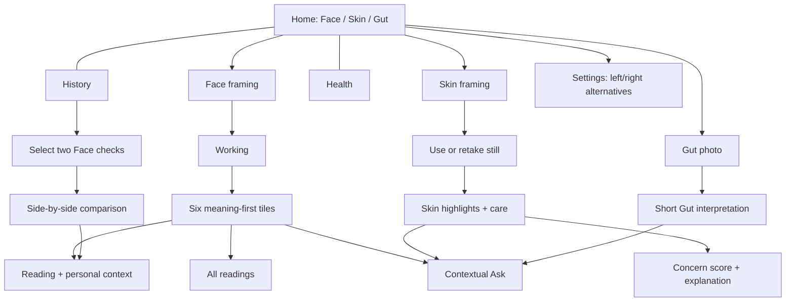

# Sweet round 2 — flows and interaction contracts

## Review setup

Open [the gallery](MOCKUPS/index.html). Every phone has a 402 × 874 viewport and independent content scrolling. [Direct Home](MOCKUPS/screen.html?screen=home-a) starts an interactive journey. All fixtures, portraits, scores, classifications, range bands and replies are illustrative. This is HTML behavior, not Swift behavior.

## Structure before polish

The product-clarity review was applied to these screen jobs. “Pass” below means an authored design review, not a human usability study. Q1 = understandable mental model; Q2 = predictable controls; Q3 = few decisions; Q4 = appropriate information; Q5 = useful hierarchy.

| Screens | Job / mental model | Q1 | Q2 | Q3 | Q4 | Q5 | Decisions / route to outcome |
| --- | --- | --- | --- | --- | --- | --- | --- |
| Home A/B/C, alternate Settings Home | Choose a short check | Pass | Pass | Pass | Pass | Pass | One of three rows; one tap to capture |
| Face ready | Place my face and begin | Pass | Pass | Pass | Pass | Pass | Frame, then Start; X exits |
| Face working / reposition | Understand whether to stay or adjust | Pass | Pass | Pass | Pass | Pass | No reading task; one line near the lens |
| Face result | See what stands out | Pass | Pass | Pass | Pass | Pass | Six familiar concepts; optional detail/Ask |
| Face detail / baseline absent | Understand one measurement in my context | Pass | Pass | Pass | Pass | Pass | One value, one personal chart or explicit absence |
| All Face readings | Find supporting readings | Pass | Pass | Pass | Pass | Pass | Scroll into detail after choosing it |
| Skin capture | Take a close, frontal selfie | Pass | Pass | Pass | Pass | Pass | One guide, one shutter, one coach line |
| Skin still review | Use this photo or retake | Pass | Pass | Pass | Pass | Pass | Two alternatives, one decision |
| Skin result | Identify a highlight and useful care priority | Pass | Pass | Pass | Pass | Pass | Meaning first; tap concern for score |
| Skin detail / all observations | Understand the concern or browse all output | Pass | Pass | Pass | Pass | Pass | Detail follows user intent; score variants explained |
| Skin rejected photo | Fix the specific capture problem | Pass | Pass | Pass | Pass | Pass | One reason; Take another selfie |
| Gut capture | Photograph this visit | Pass | Pass | Pass | Pass | Pass | Frame the whole stool; one shutter |
| Gut result | Understand this stool in a few seconds | Pass | Pass | Pass | Pass | Pass | Meaning → small scale → next step → clinician → Ask |
| Ask | Get more explanation without losing the check | Pass | Pass | Pass | Pass | Pass | One suggested follow-up; optional new question |
| History All/Face/Skin/Gut | Revisit a completed check | Pass | Pass | Pass | Pass | Pass | Filter optional; tap a row |
| Select two | Choose the checks I mean | Pass | Pass | Pass | Pass | Pass | Two selections; Compare once |
| Comparison / context mismatch | See two readings with enough context | Pass | Pass | Pass | Pass | Pass | Dates, units, context; no score for the difference |
| History empty | Start the first real entry | Pass | Pass | Pass | Pass | Pass | Choose a check |
| Health | See my patterns across time | Pass | Pass | Pass | Pass | Pass | One pattern leads; other checks stay subordinate |
| Settings left/right | Change personal preferences | Pass | Pass | Pass | Pass | Pass | Same settings structure from either entry |

### Findings resolved by the structure

| Finding | Why it fails | Fix | Severity |
| --- | --- | --- | --- |
| A raw-number wall makes the person perform interpretation | Q1/Q5 | Six Face concepts; three short Skin highlights/priorities; values on tap | BLOCKER resolved in mock |
| Guidance below the oval pulls eyes away from the camera | Q3/Q5 | One line above a higher oval | BLOCKER resolved in mock geometry |
| Competing capture sentences require memory | Q3/Q4 | Single in-place coach; guide carries framing | BLOCKER resolved in mock |
| Small Skin face framing contradicts a close-up check | Q2/Q5 | Wider guide; still review; specific rejection recovery | BLOCKER resolved in mock geometry; device fill remains unproven |
| A long Bristol lesson obstructs the check | Q3/Q4 | Result first, compact harder/looser scale, Ask for depth | BLOCKER resolved in mock |
| A clinician stack can be clipped by a pinned action | Q4 | Normal scroll flow; no overlapping clinician/action layer | BLOCKER resolved; browser reachability checked |
| Comparing incompatible measurements can suggest a false trend | Q1/Q5 | Same-method checks; time mismatch state; no wearable merging | BLOCKER resolved in illustrated cases |
| Removing raw values could become discarding outputs | Q4 | All readings / all observations remain accessible; missing values stay explicit | SHOULD resolved at presentation level |

Removed: capture disclaimer; competing capture lines; giant Home buttons; Home row chevrons; a fourth tab; History Samples; SDNN in ordinary UI; automatic “higher is better”; fixed population HRV grade; UI vendor names; repeated risk notices; giant numeric result headlines; Bristol lesson and redundant scale button. Verdict: **CLEAR TO POLISH** for the documented mock structure. Exact Ranya sentence, clinical content validation and device capture behavior are separate unresolved evidence, not claims of completion.

## Main routes

## Capture behavior

| State | Human feedback | Available action | Truth boundary |
| --- | --- | --- | --- |
| Face ready | Green oval; one top coach | Start, X | Guide is framing advice until actual position evidence exists |
| Face scanning | Neutral working dots; same oval; top instruction | X always remains available | Full green ring in gallery; prototype Start plays 4.5 seconds. This duration is not the real one-minute session |
| Face out of position | Coach changes in place; dashed green outline | Reposition; X | Explicit scenario, not image analysis. In product, resume only on valid provider state |
| Skin ready | High, wide oval; “Fill the oval with your face” | Shutter, X | No local detection or “perfect light” claims |
| Skin review | Single still | Use this photo, Retake, Back | The still is represented by an original SVG portrait |
| Skin rejected | Face-too-small cause | Take another selfie | Specific error family is documented; mock does not call the service |
| Gut ready | Whole-object viewfinder | Shutter, X | Illustrated stool; no capture or upload |

Face oval: x=58, y=170, width=286, height=384 in the 402×874 design coordinate system. Skin oval: x=43, y=167, width=316, height=414. Skin’s guide occupies 78.6% of the viewport width; actual face width, source image crop and device aspect mapping require native validation. Neither number is printed to the person. Face exterior blur is presentation-only; untouched pixels must feed measurement. Keep the forehead within Skin’s frame. Do not add competing light/distance/smile lines.

The three-dot working glyph is a slow opacity cycle, not an ECG or measured heartbeat. Reduce Motion freezes it. Do not drive an apparent pulse or countdown from arbitrary animation in production. No assumption that a face is aligned merely because time passed.

## Result behavior and output coverage

- Face: six tiles are a prioritization layer. Detail gives one value, unit, time, method and appropriate uncertainty. All readings preserves returned fields and absences; Health Indices would be labeled as models with their input context. The mock’s model section demonstrates absence rather than inventing a general score.
- HRV: only rMSSD in the human UI. The SDK field documented as lnRMSSD must not be relabeled as rMSSD. Unit/transform verification is required before connecting this design to actual values. The mock’s 42 ms is an independent synthetic fixture, not a transformation of a live SDK output.
- Baseline: the populated example declares 21 comparable morning checks and an illustrative 34–48 ms personal range. History retains all 21 mornings (Aug 24–Sep 13) plus a separate evening check. The visible chart contains seven recent points. These are design fixtures; no minimum number of checks or computation algorithm is specified by this mock. No-baseline state has a reading without a chart or grade.
- Skin: rank meaningful concerns, not 70 equal-weight numbers. Green/amber/rose always has text and a symbol. No numerical cutoff is implemented; these are authored scenarios. Detail shows the analysis score and explains the separate adjusted display score. Retain both when supplied. All outputs, regions, masks, type, composite and age remain eligible, not a fixed three-concern allowlist.
- Gut: keep all stool forms brown. Colored containers are labels, not different stool colors. “You” is text and an outline. The result is a check, not a diagnosis. The clinician block and action scroll normally.
- Save copy: this scenario depicts successful on-device storage. A real implementation must use the actual saved outcome; this HTML does not save health results. Source quality must come from actual fields, never from the illustration.

## History and comparisons

Filters are All / Face / Skin / Gut. Reopening a saved entry preserves its own date, time and values; Back preserves the selected filter. Selection permits exactly two Face entries, supports deselection, and keeps Compare disabled until two are chosen. Third selection gives corrective feedback rather than replacing the earlier choice. Cancel leaves selection. Dates and times remain attached to values. The matching example uses Sep 6, 9:38 AM and Sep 13, 9:41 AM; any other selected pair gets its actual date interval and difference; the mismatched example uses an evening check and a morning check. No difference arrow is colored as a health grade. Wearable overnight measurements never merge into the camera baseline.

## Navigation, accessibility and interruption

Home, Health and History are the only tab destinations. Ask opens within the result context; Back returns to that result. Opening the HRV baseline from comparison returns to that same selected pair. Home variants retain their identity on exit from capture. Tab roots have no Back arrow; completed results use Done without a duplicate Home action. X exits capture without a second modal. Settings top-left and top-right are alternative entry placements, not simultaneous gear buttons. Demos remain reachable from Home.

The HTML uses named controls, native buttons and links, keyboard focus outlines, text alongside color, meaningful chart descriptions, and Reduced Motion support. Phones scroll vertically. These measures and automated geometry inspection do not prove iOS VoiceOver, Dynamic Type, haptics, camera ergonomics or accessibility compliance. Large text and assistive-device validation remain implementation work. New typed Ask questions receive an explicit mock-unconnected reply, not fabricated personalized advice.
